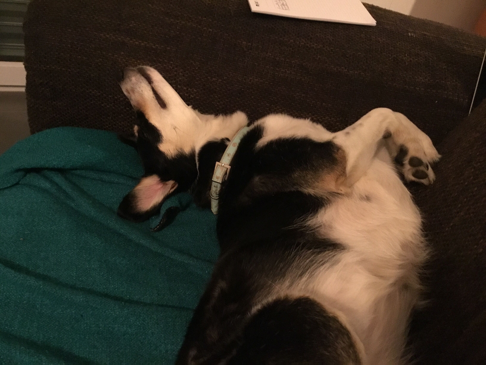

# textbook
Hello World !

**Ceci est en gras**

- J'aime bien les listes
- et aussi un autre élément de liste

[et voici un lien] (http://didapro.org/7)

Voici une nouvelle ligne !

# Un titre 1

## Un titre 2

### Un titre 3

*Et voici de l'italique*

_Ou encore de l'italique_

1. liste numérotée
1. liste numérotée 2
1. liste numérotée 3

